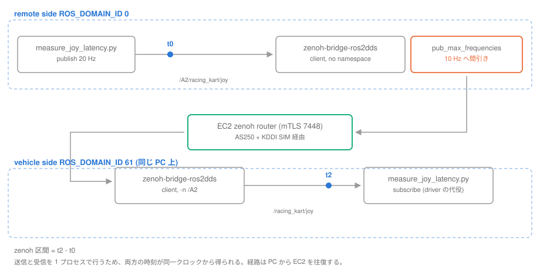
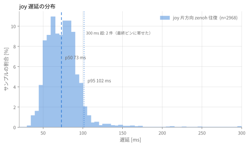
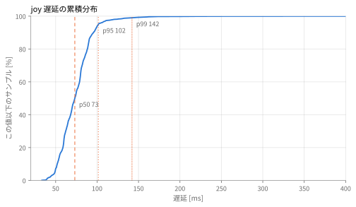
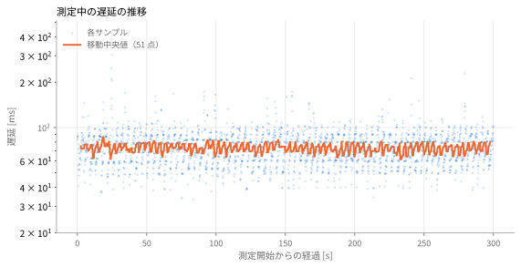

# joy トピック — 遠隔操作 PC から車両までの遅延測定

測定日: 2026-08-26 ／ 対象: `experiment0819` ブランチ ／ 回線: AS250 + KDDI SIM

## 問いと結論

**問い**: 遠隔操作 PC でスティックを倒してから、その `joy` が車両の ROS トピックに
出るまで何 ms かかるのか。

**答え**: zenoh 区間（DDS → ブリッジ → EC2 router → ブリッジ → DDS）で
**p50 73 ms / p95 102 ms / p99 142 ms**。平均 74.3 ms、標準偏差 20.8 ms
（分散 433.5 ms²）。300 秒 2968 サンプル。ただしこれは PC から EC2 を**往復**した値で、
実運用の片道はこれより短い（第 5 章）。

内訳では **TCP の往復（AS250 + KDDI SIM 区間）が約 53 ms と全体の 7 割**を占める。
ブリッジと DDS の処理は約 20 ms。**遅延は事実上、回線で決まっている。**

**ただし joy では、遅延より間引きのほうが効く。** 20 Hz で送っても車両に届くのは
9.9 Hz、到達率 49.4 %。`pub_max_frequencies` の設定が joy にもかかっている。
**遅延 73 ms に対し、間引きの待ちは最大 100 ms である。**

**測定の再現性**: 条件を変えずに 4 回、合計 762 秒・7440 サンプルを測った。
回線が劣化した 1 回を除く 3 回は p50 69〜73 ms、p95 96〜102 ms に収まっている（3.2）。
並行して記録した TCP の統計（`ss -ti`）でも、安定時は 222 秒間で再送 0 回・
RTT 平均 52.7 ms であり、アプリ層で測った遅延と TCP 層の実測が矛盾していない。

---

## 1. 目的

実車 2 台と現地を用意する前に、次を確認する。

1. 遠隔操作 PC から EC2 の zenoh router を経由して車両へ、`joy` が端から端まで届くか
2. 届くとして、**どれだけ遅れるか、どれだけ落ちるか**

ローカルの 1 台模擬には積極的な理由がある。**送信と受信を同一 PC の同一クロックで
行うため、遠隔 PC と車両 ECU のクロック誤差が測定値に混入しない。** 実機 2 台では
NTP の同期誤差（数 ms〜数十 ms）が遅延の測定値と区別できず、この分解ができない。

## 2. 実施方法

### 2.1 構成

1 台の PC 上に遠隔側ブリッジと車両側ブリッジを両方立て、どちらも EC2 router の
同じポートへ繋いだ。

| 項目 | 値 |
| --- | --- |
| **回線** | **AS250 + KDDI SIM**。PC とは USB Ethernet アダプタで接続 |
| router | `zenoh.dev.aichallenge-board.jsae.or.jp:7448`（13.231.141.103, AWS 東京）mTLS |
| ブリッジ | `zenoh-bridge-ros2dds` v1.5.0、両側とも `client` モード |
| 車両 ID | `A2`（ポート 7448 は `vehicle/vehicle_ports.sh` が決める） |
| ドメインの分離 | 遠隔側 `ROS_DOMAIN_ID` 0 / 車両側 61 |
| 設定 | `remote/zenoh-user.json5.template` と `vehicle/zenoh.json5` を無改造で使用 |
| joy | 実機なし。8 軸 11 ボタンの実寸ペイロードを 20 Hz で模擬 |

**`ROS_DOMAIN_ID` を分けることが要点。** 分けないと 2 本のブリッジが DDS で直接
つながり、EC2 を経由せずに joy が届いてしまうため測定にならない。61 を使ったのは、
51/52 が V2X の 2 車両模擬で埋まっていたためである。

QoS は実運用と揃えた。driver 側は `rclcpp::QoS(1)`
（`racing_kart_driver_node.cpp:68`）、manager 側も depth=1 なので、測定側も
depth=1 の RELIABLE を使っている。ブリッジが張るルートの性質を実運用と一致させるため。

### 2.2 計測方法



| 時刻 | 位置 | 意味 |
| --- | --- | --- |
| t0 | domain 0、publish 直前 | 送信 |
| t2 | domain 61 `/racing_kart/joy` | 車両 DDS に出た |

zenoh 区間 = t2 − t0。**送信と受信を 1 プロセスで行うため、両方の時刻が同一
クロックから得られる。**

照合キーは `header.stamp` の ns 値。zenoh は CDR をそのまま通すので ns 分解能が
経路上で失われない。V2X の測定では payload がミリ秒分解能だったためキーを切り捨てる
必要があったが、ここでは不要である。

`racing_kart_manager` は挟んでいない。manager は joy を受け取ると即座に変換して
publish する薄い層で（`racing_kart_manager.py:219`「joy 受信が唯一の publish 契機」）、
変換は Python の辞書操作のみである。また manager を意図したモードへ遷移させるには
実車のテレメトリが要るため、実車不在では条件を揃えられない。

### 2.3 測定条件

300 秒連続、送信 20 Hz。設定は無改造。静止した屋内での測定である。

測定開始前に 30 秒の助走を置き、統計には入れていない。**測定プロセスを起動し直した
直後はブリッジが古い subscriber の undeclare を処理しきっておらず、ルートが張られない
ことがある**ため。ルート自体は 0.3 秒で立つ。

## 3. 結果

### 3.1 遅延

単位はすべて ms、分散のみ ms²。n = 2968。

| 区間 | mean | SD | 分散 | min | p50 | p95 | p99 | max |
| --- | ---: | ---: | ---: | ---: | ---: | ---: | ---: | ---: |
| **zenoh** | **74.3** | **20.8** | **433.5** | **33.3** | **73.1** | **101.5** | **142.1** | **426.1** |

60 秒ごとに割っても水準は動かない。

| 経過 [s] | n | 受信 [Hz] | p50 | p95 | max |
| --- | ---: | ---: | ---: | ---: | ---: |
| 0–60 | 592 | 9.9 | 73.4 | 106.7 | 426.1 |
| 60–120 | 594 | 9.9 | 73.2 | 100.8 | 173.1 |
| 120–180 | 593 | 9.9 | 74.2 | 102.5 | 172.4 |
| 180–240 | 593 | 9.9 | 70.6 | 100.3 | 153.6 |
| 240–300 | 593 | 9.9 | 73.3 | 101.0 | 229.2 |

### 3.2 4 回の測定で値が一致している

条件を変えずに 4 回測った。合計 762 秒、7440 サンプル。

| 測定 | 長さ [s] | n | p50 | p95 | 実効受信 [Hz] |
| --- | ---: | ---: | ---: | ---: | ---: |
| 1 回目 | 120 | 1090 | 82.5 | 310.9 | 9.08 |
| 2 回目 | 120 | 1186 | 72.3 | 95.9 | 9.89 |
| 3 回目（主データ） | 300 | 2968 | 73.1 | 101.5 | 9.89 |
| 4 回目 | 222 | 2196 | 69.2 | 99.5 | 9.88 |

**1 回目を除く 3 回は p50 69〜73 ms、p95 96〜102 ms に収まっている。** 1 回目だけ
値が悪いのは、測定の途中で回線が劣化したためである（3.5）。その回も前半 60 秒は
他と一致していた。

### 3.3 到達率 — joy は 10 Hz に間引かれている

**送信 6006 件に対し受信 2968 件、到達率 49.42 %、実効受信レート 9.89 Hz。**

これは損失ではなく間引きである。`vehicle/zenoh.json5` と
`remote/zenoh-user.json5.template` の両方にある次の設定が効いている。

```json5
pub_max_frequencies: ["/*=10"],
```

ブリッジの起動ログにも `pub_max_frequencies: [(Regex("/*"), 10.0)]` と出る。
送信レートを変えて確かめた結果は次のとおりで、10 Hz を超えた分だけが捨てられている。

| 送信 [Hz] | 受信 [Hz] | 到達率 |
| ---: | ---: | ---: |
| 5 | 5.0 | 100.00 % |
| 20 | 9.9 | 49.38 % |

`racing_kart_manager_core.py` の `TELEMETRY_TIMEOUT_S` のコメントにも
「zenoh が全トピックを 10Hz に間引く」とあり、設計者の認識と一致している。

### 3.4 時間の使われ方

測定と並行して、ブリッジが張っている TCP コネクションの状態を 1 秒刻みで記録した
（`ss -ti`）。222 秒間の **TCP RTT は平均 52.7 ms、再送は 0 回**だった。

joy は「遠隔側ブリッジ → router」と「router → 車両側ブリッジ」の 2 本の TCP
コネクションを続けて通る。どちらも同じ PC と EC2 のあいだなので、片道はおよそ
RTT の半分である。

| 内訳 | 平均 [ms] | 割合 |
| --- | ---: | ---: |
| TCP 往復（AS250 + KDDI SIM 区間、片道 × 2 本） | 約 53 | 約 72 % |
| ブリッジの処理 + DDS 2 回分（差分） | 約 20 | 約 28 % |
| **zenoh 区間** | **73** | **100 %** |

V2X の `mqtt` 区間が全体の 77 % を占めていたのと同じ構図で、**joy でも支配的なのは
回線の往復時間**である。ROS 側の処理で削れる余地は無い。

### 3.5 分布とばらつき



V2X で見られたような二峰性は無く、73 ms を頂点とした単峰である。V2X の
`/v2x/vehicle_positions` は集約タイマーを持つため遅延がタイマー周期に引き寄せられたが、
joy の経路にはタイマーが無く、ブリッジが受け取った順にそのまま流すためである。

標準偏差 20.8 ms は素直に読んでよい。裾は右に伸びており、p99 142 ms に対し
max は 426 ms。



### 3.6 時間推移



300 秒を通じて移動中央値は 73 ms 付近に留まり、劣化する傾向は無い。

ただし**別の 120 秒測定では、途中から明確に劣化する回があった。**

| 経過 [s] | n | 受信 [Hz] | p50 | p95 | max |
| --- | ---: | ---: | ---: | ---: | ---: |
| 0–30 | 296 | 9.9 | 73.9 | 114.9 | 170.6 |
| 30–60 | 297 | 9.9 | 72.5 | 97.4 | 106.3 |
| 60–90 | 241 | 8.0 | 87.8 | 361.7 | 2445.6 |
| 90–120 | 255 | 8.5 | 145.9 | 365.9 | 1531.3 |

前半 60 秒は他の測定と一致しているのに、60 秒以降で p50 が倍近くになり、
**同時に受信レートも 9.9 → 8.0 Hz へ落ちている**。遅延が伸びただけでなく
メッセージが消えている。最悪値は 2.4 秒に達した。

この回でも V2X の 2 車両模擬（`v2x_d2` / `v2x_d3`）は動いたままであり、
安定していた他の測定でも同じく動いていた。**したがって V2X との帯域競合による
定常的な輻輳ではない。** joy は 20 Hz でも 24 kbps、V2X を足しても 100 kbps に
届かず、LTE の容量に対して無視できる。

### 3.7 疎通と受信品質

| 確認項目 | 結果 |
| --- | --- |
| mTLS クライアント認証 | 両ブリッジとも受理。相互に `New ROS 2 bridge detected` |
| ルートの確立 | 車両側に subscriber が出てから 0.2〜0.3 秒（4 回とも） |
| 到達率 | 49.4 %（送信 20 Hz、間引き後 9.9 Hz） |
| 送信 5 Hz での到達率 | 100.00 %（間引きの閾値を下回るため全通） |
| TCP 再送 | 安定時 222 秒で 0 回 |
| ペイロード | 8 軸 11 ボタン、実運用と同寸 |
| 名前空間の付け外し | `/A2/racing_kart/joy` → `/racing_kart/joy` に正しく戻る |

**ROS_DISTRO を渡さずにブリッジを起動すると警告が出る。** `zenoh-bridge-ros2dds` は
未設定だと `iron` を仮定して GID を 16 バイトとして読むが、Humble は 24 バイトである。
コンテナ内では compose が `ROS_DISTRO=humble` を渡しているため出ないが、ホストで
直接起動するときは明示しないと `ros_discovery_info` のパースに失敗する。
`run_joy_bridges.sh` では明示している。

## 4. 考察

### 4.1 操作の古さは遅延より間引きで決まる

受信側が持つ joy の古さは、遅延に**間引きの待ちが上乗せされる**。

| 内訳 | 値 |
| --- | ---: |
| zenoh 区間 p50 | 73 ms |
| 10 Hz 間引きの待ち | 最大 100 ms |
| 合計 | 最大 173 ms |

**遅延を削るより、間引きを外すほうが効く。** 遅延 73 ms は回線と物理距離で決まり
こちらでは短縮できないが、間引きは設定 1 行である。joy は 24 kbps しか使わないので、
20 Hz へ上げても帯域の心配はない。

ただし `pub_max_frequencies` は**全トピックに一律にかかる**。joy だけ上げるには
トピックごとに書き分ける必要がある。テレメトリ（`velocity_status` など）まで 20 Hz に
なると、車両 1 台あたりの上り帯域が増える。

### 4.2 `pub_max_frequencies` の書き方は正しくない

`"/*=10"` の `/*` は glob のつもりで書かれていると思われるが、**zenoh はこれを
正規表現として扱う**。正規表現の `/*` は「`/` が 0 回以上」であり、空文字列にマッチする。
`allow` のリストが `^/A2/racing_kart/joy$` とアンカー付きで組まれるのに対し
`pub_max_frequencies` はアンカーされないため、部分マッチで**あらゆるトピック名に
マッチしてしまう**。

結果として意図（全トピックを 10 Hz に）どおりに動いてはいるが、それは偶然である。
`".*=10"` と書くのが正しい。トピックごとに書き分けるときは、この違いが効いてくる。

### 4.3 ブリッジのルートは 0.3 秒で立つ

測定のたびに記録した「最初の受信まで」は、いずれの回も 0.2〜0.3 秒だった。
車両側ドメインに subscriber が現れてからブリッジがルートを張るまでの時間である。

一方で、**測定プロセスを終了した直後に次を起動すると、ルートが張られないまま
1 件も届かないことがある**。古い subscriber の undeclare 処理と新しい subscriber の
出現が重なるためと見られる。30 秒空ければ再現しない。遠隔 PC 側のプロセスを
再起動する運用では留意が要る。

## 5. 本測定の限界

この数字をそのまま実運用の値として扱うことはできない。

- **往復であって片道ではない。** 送信も受信も同じ PC なので、経路は PC → EC2 → PC。
  実運用では遠隔 PC → EC2 → 車両 ECU の片道になる。両者が EC2 から等距離なら
  片道は約半分だが、車両側は現地の回線であり、等距離である保証はない
- **ジョイスティック HW → `joy_node` の遅延を含まない。** t0 は publish 直前である
- **車両側の `/racing_kart/joy` → driver → CAN → VCU を含まない**
- **`racing_kart_manager` の変換を含まない**（2.2 参照）
- **静止した屋内での測定。** 走行中のカートの電波環境（移動、ハンドオーバ、車体による
  遮蔽）は反映されていない。3.4 で見た劣化はこれより頻繁に起きると考えるべき

## 6. 次にやること

- **劣化イベントの原因切り分け。** 判定の仕掛けは用意し（`probe_link.py` と
  `correlate_link.py`）、安定時は TCP 再送 0 回・RTT 52.7 ms であることまで確認したが、
  **並行記録を回しているあいだに劣化を踏まなかったため切り分けは未達**。劣化の瞬間に
  再送が跳ねていれば経路（LTE 区間）、跳ねていなければ router かブリッジと判定できる。
  長時間回すか、WiFi 経由の対照を同時に立てるのが次の一手
- **`pub_max_frequencies` を joy だけ 20 Hz にする案の検討。** 帯域への影響を見積もったうえで
- **実車・走行中での再測定**
- 遠隔 PC 側プロセス再起動時のルート再確立の挙動確認

## 付録 A — 再現手順

スクリプトは `remote/tools/` に置いた。使い方は
[remote/tools/README.md](../remote/tools/README.md) を参照。

```bash
# 1) 両ブリッジを起動（前景。Ctrl+C で両方畳む）
./remote/tools/run_joy_bridges.sh -v A2 -d 61

# 2) 別シェルで測定
source /opt/ros/humble/setup.bash
python3 remote/tools/measure_joy_latency.py \
    --rate 20 --duration 300 --warmup 30 \
    --csv output/joy-latency/data/joy_e2e.csv

# 3) 集計と作図
python3 remote/tools/summarize_joy_csv.py output/joy-latency/data/joy_e2e.csv --bucket 60
uv run remote/tools/plot_joy_latency.py \
    --csv output/joy-latency/data/joy_e2e.csv --out docs/images
```

| スクリプト | 役割 |
| --- | --- |
| `run_joy_bridges.sh` | 遠隔側と車両側のブリッジを 1 台の PC 上で両方起動 |
| `measure_joy_latency.py` | joy を送りながら車両側で受け、同一クロックで遅延を測る |
| `probe_link.py` | TCP の再送・RTT を並行記録する（劣化の原因切り分け用） |
| `summarize_joy_csv.py` | CSV から統計と時間推移の表を出す |
| `plot_joy_latency.py` | CSV から本レポートの図を生成 |
