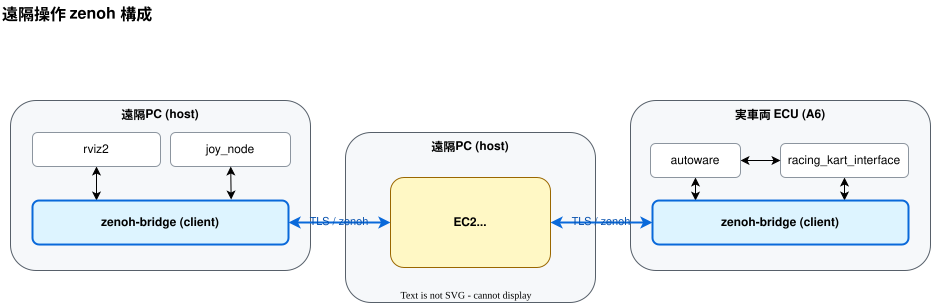
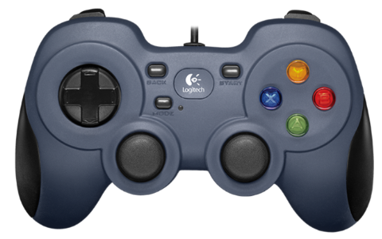

# 遠隔操作環境構築方法・遠隔操作方法

走行中の緊急停止や手動走行は、車両に接続したノートPCに接続されたゲームコントローラを用いて遠隔操作で行います。

ノートPCと自動運転車両間の通信が途絶したり、ゲームコントローラがノートPCから抜けたときには自動運転車両が緊急停止するような安全機能が入っています。

※途絶判定のしきい値が5秒になっているため、ゲームコントローラが抜けた瞬間に車両が止まるわけではないです。



# 第1部 共通セットアップ

### 1-1. ROS 2 Humble

```
ros2 topic list   # 動けばOK。
```

### 1-2. リポジトリ取得

```shell
cd $HOME
git clone git@github.com:AutomotiveAIChallenge/aichallenge-racingkart.git
cd aichallenge-racingkart
```

### 1-3. 環境セットアップ & イメージ取得

```
./setup.bash bootstrap
```

### 1-4. Zenoh bridge（ホストにインストール）

```
sudo dpkg -i vehicle/zenoh-bridge-ros2dds_1.5.0_amd64.deb
apt list --installed zenoh-bridge-ros2dds   # 1.5.0 ならOK
```

### 1-5. ゲームコントローラ用 joy パッケージ

```
sudo apt install -y ros-humble-joy
sudo usermod -aG input "$USER"
# 再ログインして反映する
```

### 1-6. TLS 証明書の配置

`remote/tls/` に配布 zip を展開。

> （図：TLS zip の配置例。Confluence 掲載画像・ローカル未取得）

```
ls remote/tls          # client  server
ls remote/tls/client   # cert.pem  key.pem(600)
ls remote/tls/server   # minica.pem
```

### 1-7. CycloneDDS / RMW 設定

`~/.bashrc` に以下があること：

```
export RMW_IMPLEMENTATION=rmw_cyclonedds_cpp
export CYCLONEDDS_URI=file:///opt/autoware/cyclonedds.xml
```

`/opt/autoware/cyclonedds.xml` の NetworkInterface に `name="lo"` があること：

```
grep -i NetworkInterface ${CYCLONEDDS_URI#file://}
```

### 1-8. `.env` に車両番号を設定

リポジトリ直下の `.env` を開き、`VEHICLE_ID` の行を対象車両に合わせて書き換える（今回は A6）：

```diff
- VEHICLE_ID=A0
+ VEHICLE_ID=A6
```

---

# 第2部 ノートPC1台で遠隔操作動作確認

**目的**：PC 1台の中に「A6車両側」「遠隔側」を両方立て、両者を実EC2(A6:7450) に client 接続し、joy 操作が EC2 経由で車両側（A6）に届くことを確認する。

### 2-1. 手順

ターミナルウィンドウを4つ用意する。ros2 端末は先に `source /opt/ros/humble/setup.bash` を実行しておく必要がある。

```shell
# 端末A: 車両側 zenoh bridge（domain1 → EC2 A6）
cd ~/aichallenge-racingkart && make zenoh

# 端末B: 車両側(A6)の joy 受け手（domain1）。echo 自体が subscriber になり bridge が転送を開始
source /opt/ros/humble/setup.bash
ROS_DOMAIN_ID=1 ros2 topic echo /racing_kart/joy

# 端末C: 遠隔側 zenoh bridge（domain0 → EC2 A6）
cd ~/aichallenge-racingkart/remote
ROS_DOMAIN_ID=0 ./connect_zenoh.bash A6

# 端末D: 遠隔側で joy を流す（domain0）
source /opt/ros/humble/setup.bash
ROS_DOMAIN_ID=0 ros2 topic pub -r 10 /racing_kart/joy sensor_msgs/msg/Joy \
  '{header: {frame_id: "joy"}, axes: [0.1,0.5,0.0,0.0], buttons: [1,0,0,0]}'
```

### 2-2. 合否判定

```
source /opt/ros/humble/setup.bash
ROS_DOMAIN_ID=1 ros2 topic hz /racing_kart/joy     # ~10Hz なら合格
```

---

# 第3部 実機構成（実車両＋遠隔PC）

実車両（A6 など、実カートの ECU）と遠隔PC を EC2 経由でつなぐ本番の遠隔操作。

### 3-1. 遠隔操作の流れ（遠隔PC 側）

ターミナルウィンドウを2つ用意する。

```shell
cd ~/aichallenge-racingkart

# 端末A: joy_node（コントローラ入力 → /racing_kart/joy）
cd remote && ./joy.bash

# 端末B: 車両と zenoh 接続（EC2 A6:7450 へ client 接続 / TLS）
cd remote && ./connect_zenoh.bash A6
```

（車両側 ECU では別途 `make autoware-driver-zenoh` 等で driver/autoware/zenoh を起動する。）

### 3-3. 終了手順

```
cd ~/aichallenge-racingkart
make down            # コンテナ停止（rviz2 は Ctrl+C では残るので必ず down）
docker compose ps    # 何も残っていないこと
```

# 第4部 ゲームコントローラの使い方

ロジクールF310を使用して遠隔操作します。

https://gaming.logicool.co.jp/ja-jp/products/gamepads/f310-gamepad.940-000137.html



ゲームコートローラの各ボタンの機能は以下の図の通りです。


